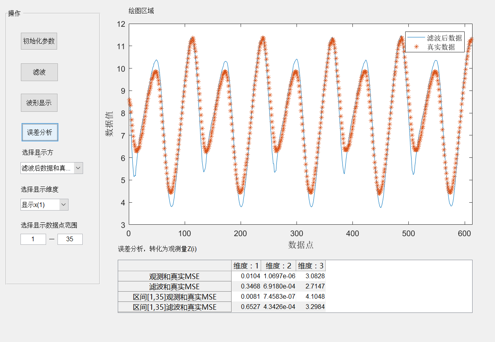

KalmanGui
===========================
    kalman滤波的GUI。
    针对为线性变不变系统，线性时变，非线性时不变，非线性时变系统。
    采用kF,UKF方法，支持固定的采样时间，使用(sat)输入表示
    噪声为不相关的高斯白噪声。

****
## 目录
* [主界面](#主界面)
* [参数初始化](#参数初始化)
* [待完善功能](#待完善功能)

### 主界面
-----------
 ? ?主界面如下：

参数初始化
------

待完善功能
------
